# Ornament Drawer

<h3>---------------------------Just for fun-------------------------</h3>

- Java 17
- Spring Core

Программа, которая генерирует такие изображения:

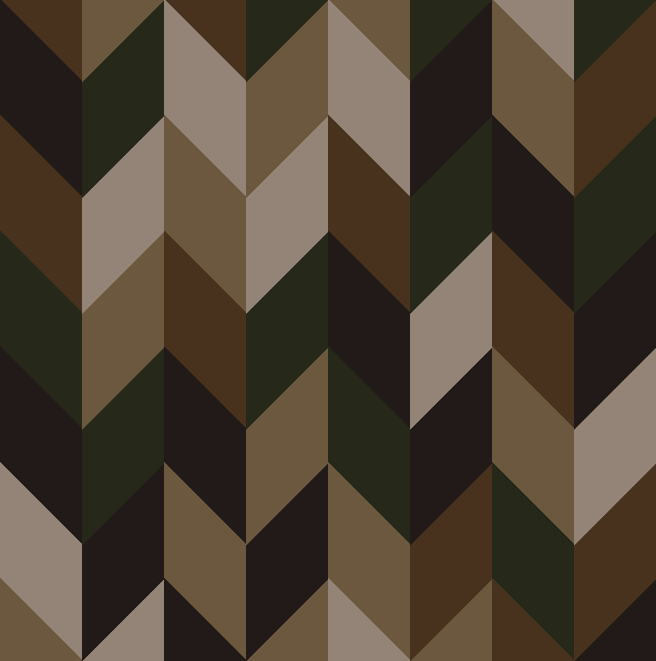

Отредактируйте файл конфигурации ./src/main/resources/[app.properties](src%2Fmain%2Fresources%2Fapp.properties), чтобы изменить настройки.

### Пример работы приложения(нажимаю кнопку regenerate):

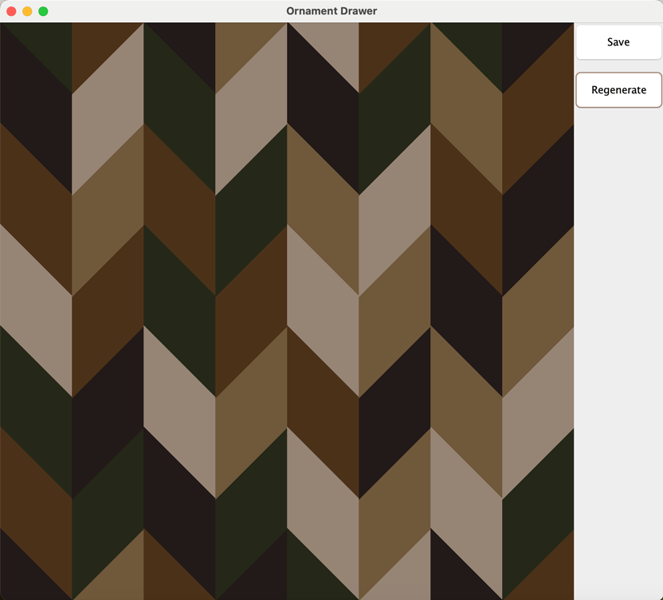

---

## С чего все началось

В жизни у меня было много разных хобби:
- рисование, 
- вышивание лентами, 
- вышивание крестиком,
- создание заколок,
- 3D-моделирование одежды и мебели
- создание пользовательского контента для The Sims
- квиллинг
- макияж
- ногти
- ...

И наконец, я решила купить **швейную машинку**, чтобы шить себе в первую очередь домашний текстиль и всевозможные косметички/органайзеры

---

Насмотревшись Pinterest(мой давний друг), решила я сшить себе чехол на декоративную подушку в технике лоскутного шитья

<h3>Но какой именно?</h3>

<i>Этого я не знала...</i>

<h3>Но хочется</h3>

---

<i>Ну-с, начнем</i>:

- Для начала определимся с палитрой:

<i>Хочется чего-то нейтрального, что ассоциировалось бы с природными оттенками... 

Ищем...

Находим

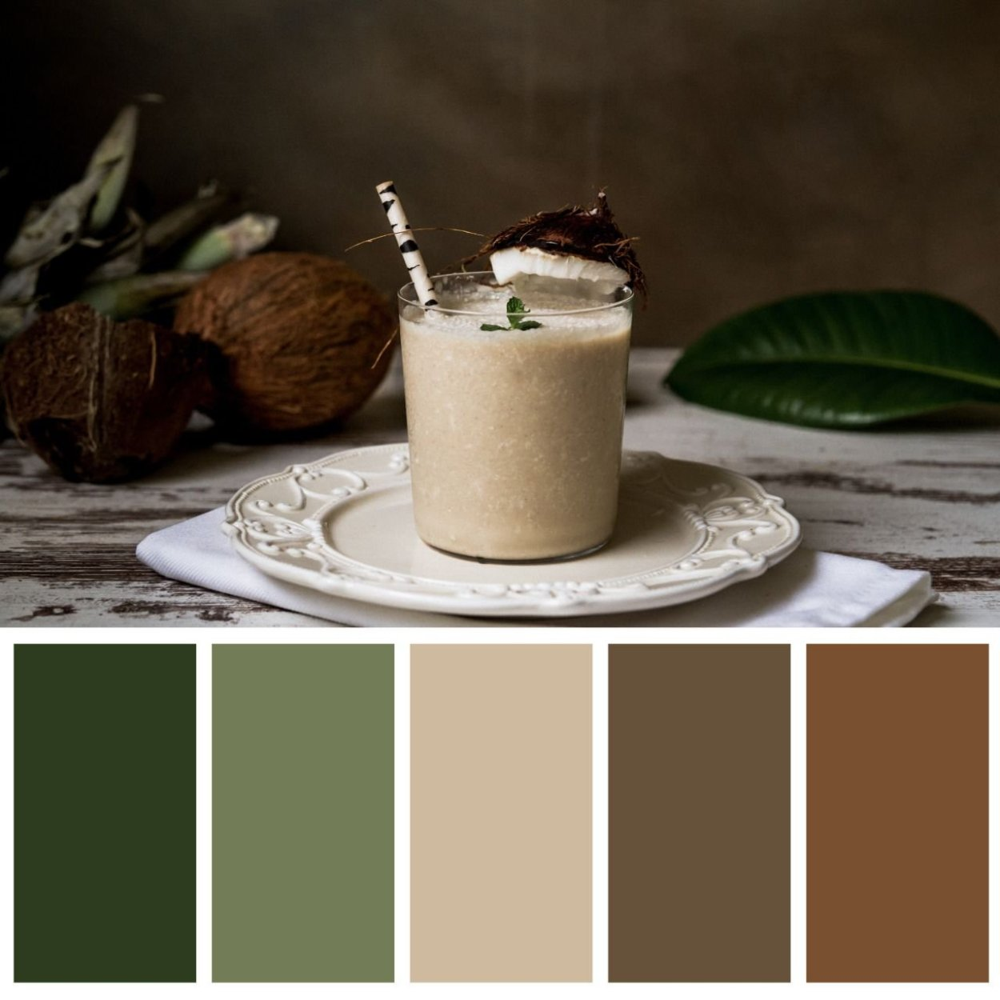

Ищем ткани...

Находим:</i>

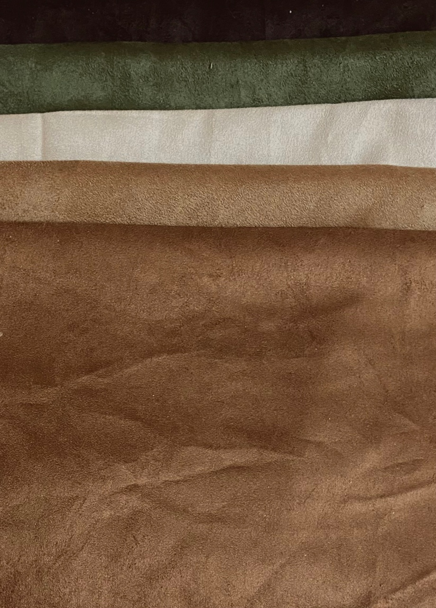

<i>
Очень приятная на ощупь ткань - искуственная замша, но придется с ней немного повозиться:
</i>

- следить за направлением ворса при раскрое

- не делать машинных строчек по лицевой части, потому что ворс очень скользит и ткань не будет двигаться зубчиками на пластинке машины

---
## Пора определиться с орнаментом...
_И это оказалось самым сложным_

Меня вдохновляло японское лоскутное шитье, но мне не хотелось использовать ткань с узором, к тому же такие тонкие хлопчатобумажные ткани не очень практичны

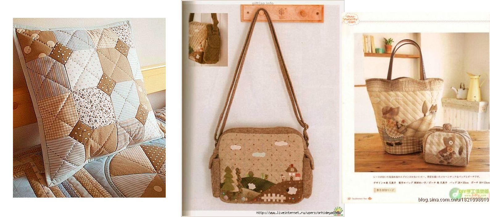

Хотелось чего-то более минималистичного, но стандартные схемы пэтчворка(лоскутного шитья) казались слишком скучными, а некоторые - нелепыми

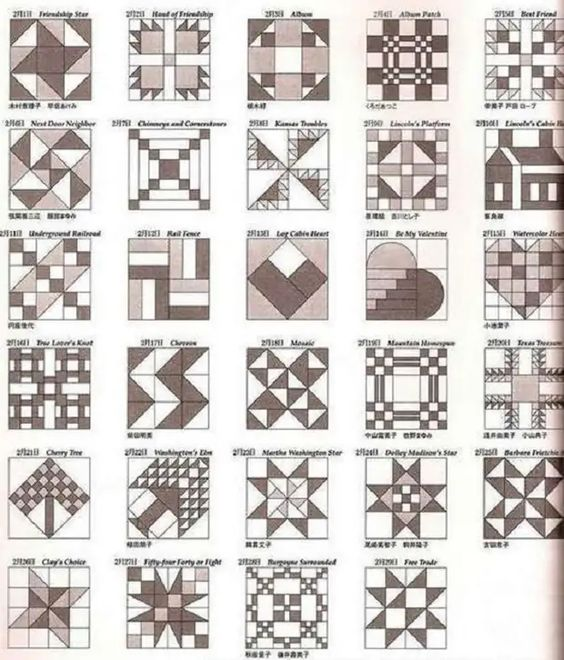

Я уже почти отчаялась, но мне попался такой узор:

_И я поняла, чего я хочу_

---

## Орнамент "Французская елка"

_вернее схема раскладки паркета_

Выглядит вот так:

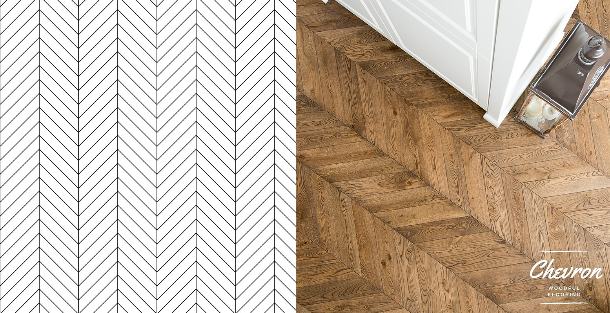

_"Осталось вбить в гугл - и я найду какой-то похожий орнамент из лоскутков ткани"_ - подумала я

#### _Но нет_

Ничего похожего я не нашла

#### Может помогут нейросети?

## Тоже нет

_Я мучила несколько нейросетей, но ни одна из них искренне не знала, что такое "схема раскладки паркета Французская елка"_

---
## Ну, значит пора писать код
Вооружившись генератором случайных чисел, python-ом и pygame-ом, ~~а так же бубном для танцев, затем валерьянкой,~~ я приступила к работе

Получаю что-то такое

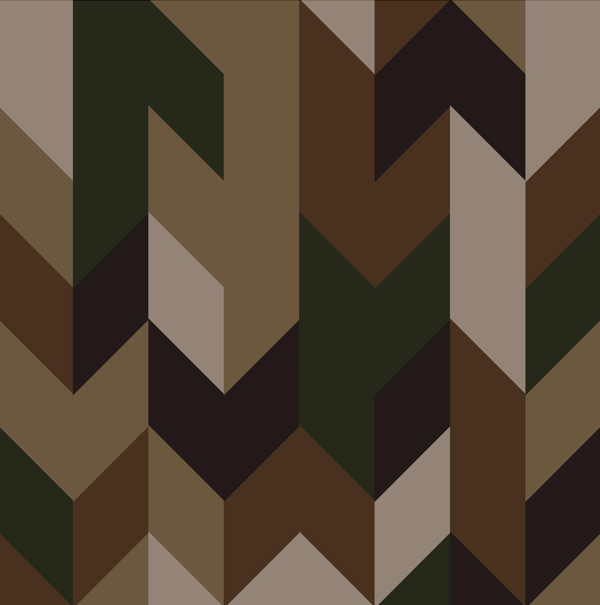

Соседние кусочки одинакового цвета - непорядок, исправляем, подключая извилины и алгоритмы
- проверяем, что в "**двумерной окрестности фон Не́ймана порядка 1**" клетки нет клеток такого же цвета, иначе берем другой случайный цвет (на самом деле проверяем только ту, что сверху и ту, что слева, т.к. генерируем случайный цвет итеративно)

Получаем это:

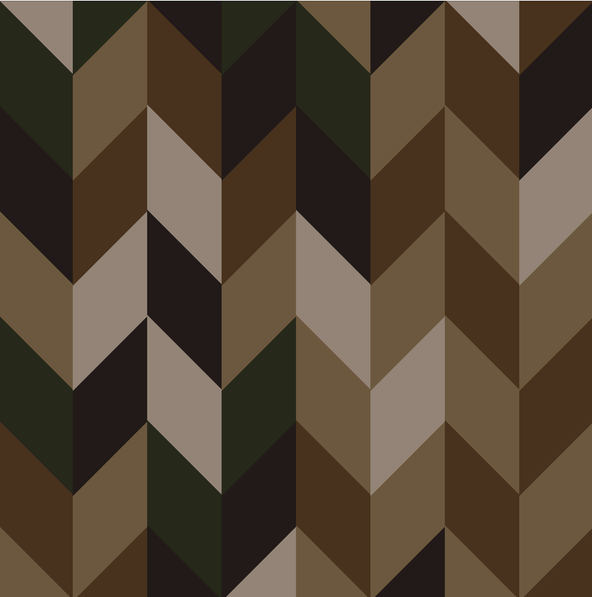

Уже гораздо лучше, но при генерации не получается получить узор, достаточно равномерный по распределению цветов, но при этом без повторений, которые бросаются в глаза

Значит пора подумать над этим, и т.к. код уже разрастается, то лучше бы переписать это на java и включить в свои pet-проекты (=

---
## Java 

Поразмыслив над предыдущим вопросом, одновременно переписывая свой код с python на java, мне пришла мысль, что нужно:

- Добавить статистику по цветам в виде количества разных форм узора для каждого цвета. Напоминаю: ткань, из которой я собираюсь сшить чехол, имеет ворс с определенным направлением и является односторонней. Так что необходимо различать четные и нечетные параллелограммы(хотя по расчетам это вполне себе ромбы с острым углом в 45 градусов), чтобы правильно раскроить (разрезать на кусочки) ткань.
- Добавить кнопки для регенерации узора и сохранения его со статистикой (ранее для этого использовались просто клавиши 'пробел' и 'S' соответственно)
- Добавить конфигурацию из .properties файла с последующей валидацией
- Ну и собственно решила, как я буду разбираться с "недостаточно случайным" для моей чувствительной творческой натуры узором

_Последнее привело к такому, особое внимание прошу обратить на название методов: (очень страшно)_ 

    public boolean checkVerticalOnHorizontalPairsManyRepeats() {
        for (int row = 1; row < entry.length; row++) {
            List<int[]> levelPairs = new ArrayList<>();
            for (int j = 0; j < entry[0].length; j++) {
                levelPairs.add(new int[]{entry[row - 1][j], entry[row][j]});
            }
            if (checkEqualPairs(levelPairs)) {
                return true;
            }
        }
        return false;
    }

    public boolean checkOneVerticalPairsManyRepeats() {
        int colIndex = 0;

        while (colIndex < entry[0].length) {
            List<int[]> levelPairs = new ArrayList<>();
            for (int i = 1; i < entry.length; i += 2) {
                levelPairs.add(
                        new int[]{entry[i - 1][colIndex], entry[i][colIndex]});
            }
            if (checkEqualPairs(levelPairs)) {
                return true;
            }
            levelPairs = new ArrayList<>();
            for (int i = entry.length - 1; i > 0; i -= 2) {
                levelPairs.add(
                        new int[]{entry[i - 1][colIndex], entry[i][colIndex]});
            }
            if (checkEqualPairs(levelPairs)) {
                return true;
            }
            colIndex++;
        }
        return false;
    }

    public boolean checkHorizontalPairsManyRepeats() {
        for (int[] ints : entry) {
            List<int[]> levelPairs = new ArrayList<>();
            for (int j = 1; j < entry[0].length; j += 2) {
                levelPairs.add(new int[]{ints[j - 1], ints[j]});
            }
            if (checkEqualPairs(levelPairs)) {
                return true;
            }
        }
        return false;
    }

_"Я - великий грешник и у всех прошу прощения."_

Нынешний вид приложения выглядит как-то так:

в целом, меня это устраивает, генерация неплоха, к тому же статистика исчерпывающая:

    Light Beige:
    fullLeft=3, fullRight=4, halfLeftUp=1, halfRightUp=0, halfLeftBottom=0, halfRightBottom=2
    
    Dark Beige:
    fullLeft=2, fullRight=6, halfLeftUp=2, halfRightUp=0, halfLeftBottom=0, halfRightBottom=2
    
    Light Brown:
    fullLeft=6, fullRight=1, halfLeftUp=0, halfRightUp=3, halfLeftBottom=1, halfRightBottom=0
    
    Dark Brown:
    fullLeft=3, fullRight=4, halfLeftUp=1, halfRightUp=1, halfLeftBottom=1, halfRightBottom=0
    
    Green:
    fullLeft=6, fullRight=5, halfLeftUp=0, halfRightUp=0, halfLeftBottom=2, halfRightBottom=0

---

### Вернемся к подушке:

Так как наступили новогодние каникулы, и я уехала далеко от швейной машины и ткани, а ~~заниматься изучением SpringBoot довольно уныло~~ хочется представить, как будет выглядеть финальное изделие, я расчехляю...

## Marvelous Designer

Лучшее приложение, которое я видела

_*Marvelous Designer – это программа моделирования, симуляции и анимации одежды. В этой программе с нуля можно создать одежду и текстиль любой сложности. Пройдя длинный путь от простенького генератора ткани, сейчас эта программа заслуженно занимает флагманский олимп среди программ симуляции одежды._

Рисуем 2 квадратика, "сшиваем" их, запускаем симуляцию:
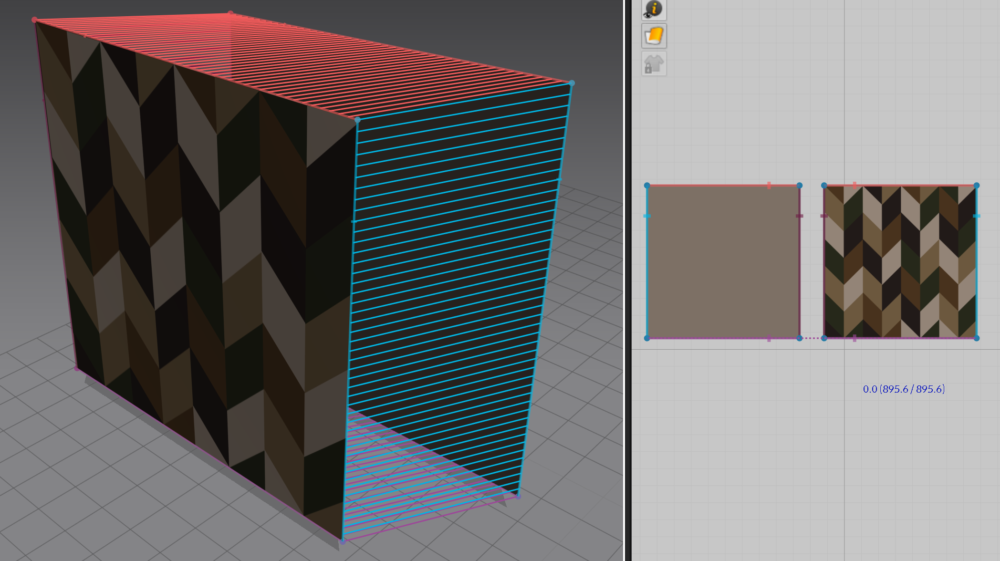
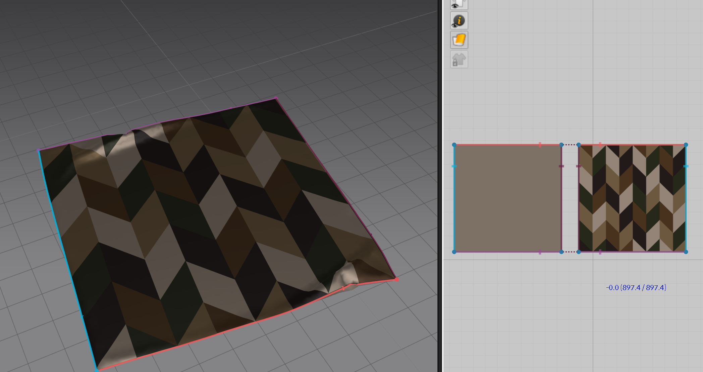
Получается плоский чехольчик, добавляем давление:
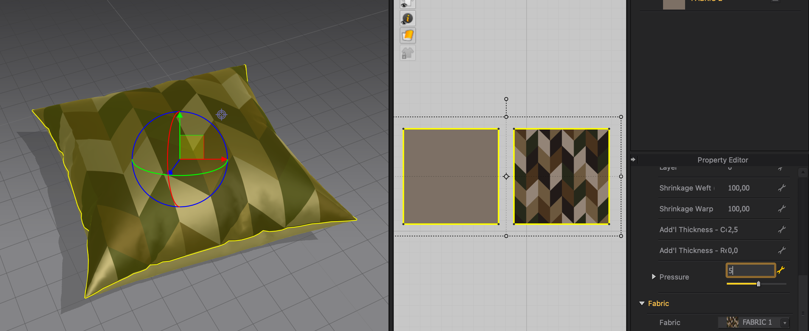

### Получаем уже подушку:

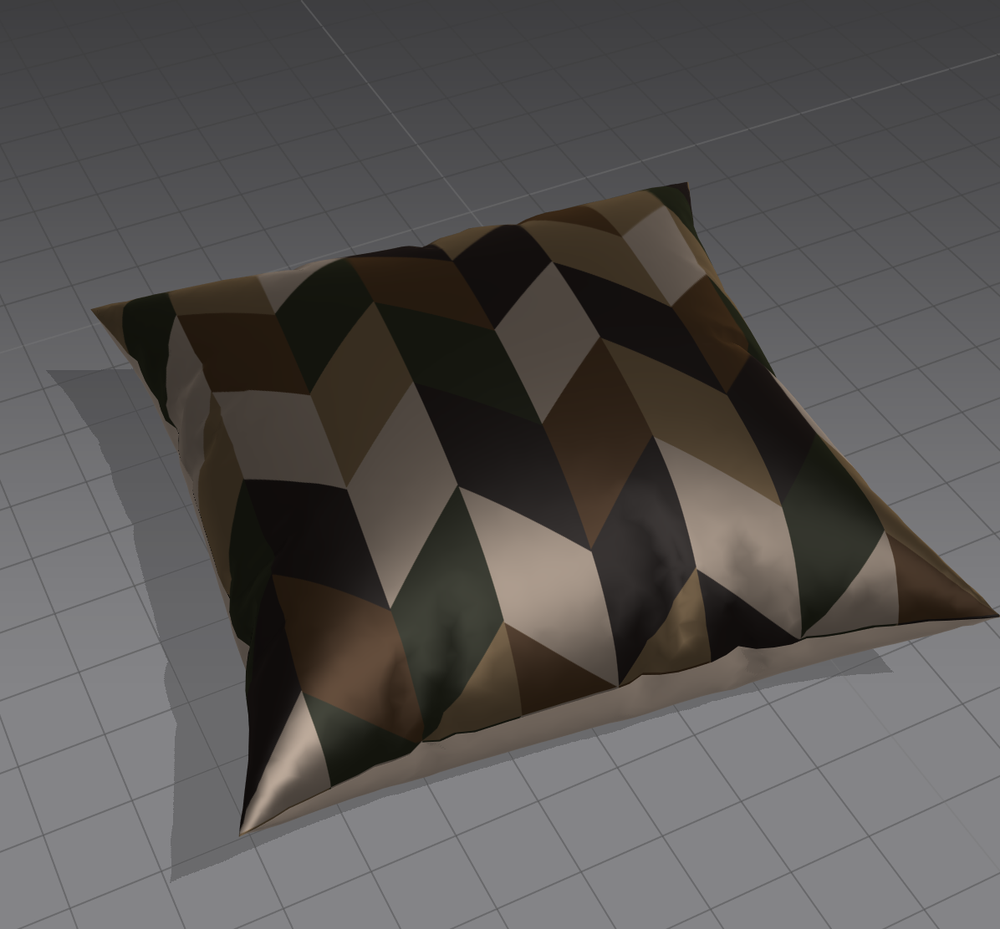

_Но узор какой-то плоский, все-таки это должно выглядеть, как сшитые кусочки_

___

## Карта нормалей

_***Карты нормалей** – это RGB изображения, где каждый из каналов (красный, зелёный, синий) интерпретируется в X, Y и Z координаты нормалей поверхности соответственно. Красный канал пространства касательных карты нормалей отвечает за ось X (нормали направленны влево или вправо), зелёный канал за ось Y (нормали направлены вверх или вниз) и синий канал за ось Z (нормали направлены прямо от поверхности)._

Не буду описывать в деталях, как рисовать/генерировать карты нормалей, так как это просто README для моего проекта, а не обучающее пособие, в интернете полно уроков по этому вопросу.

Я просто нарисовала карту нормалей в Photoshop методом проб и ошибок, получилось так:

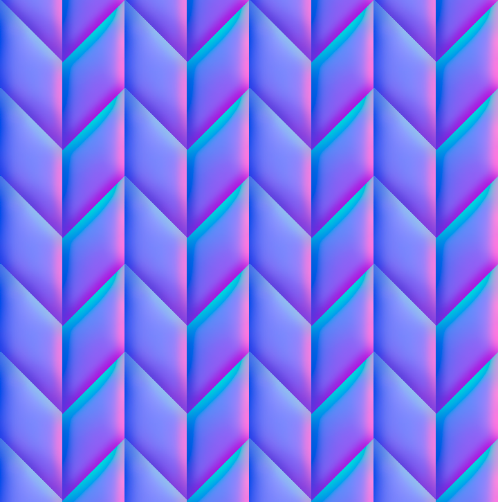

И подушка с картой нормалей выглядит так:

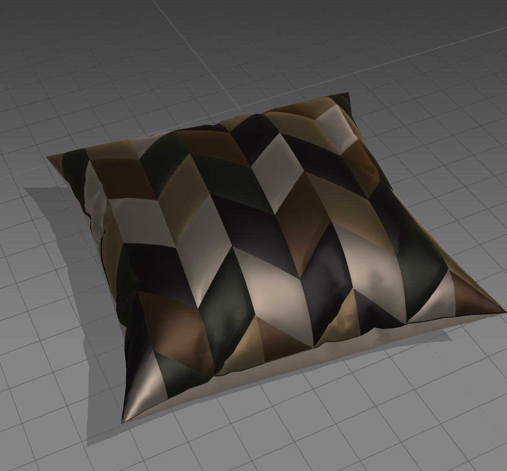

_Красиво, я собой довольна (=_

---

## Финально:

После нескольких вечеров раскроя и шитья получилось это:

### _Спасибо всем, кто это прочитал(если такие есть)_

