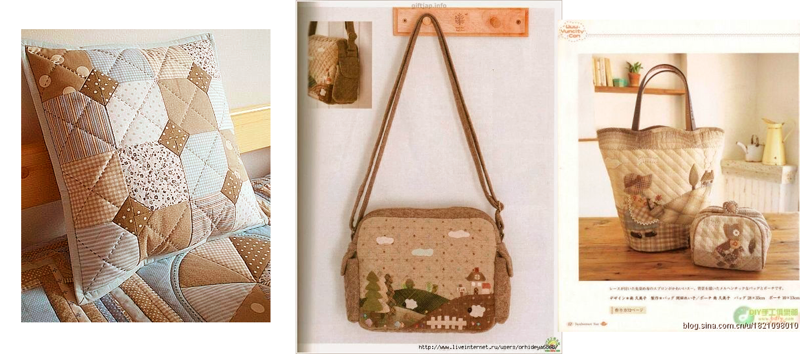
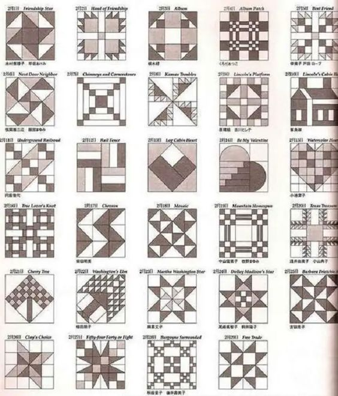
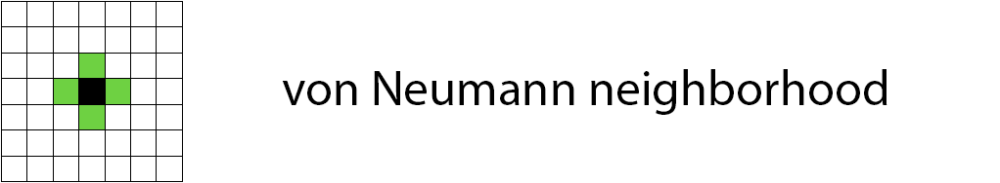

# Ornament Drawer

<h3>--------------------------Just for fun----------------- --------</h3>

- Java 17
- Spring Core

A program that generates images like this:

Edit the configuration file ./src/main/resources/[app.properties](src/main/resources/app.properties) to change the
settings.

### Example of the application (I press the regenerate button):

---

## How it all started

In my life I had many different hobbies:

- drawing,
- embroidery with ribbons,
- cross stitch,
- making hairpins,
- 3D modeling of clothing and furniture
- creating custom content for The Sims
- quilling
- makeup
- nails
- ...

And finally, I decided to buy a **sewing machine** to primarily sew home textiles and all kinds of cosmetic
bags/organizers for myself.

---

After looking at Pinterest (my old friend), I decided to sew myself a decorative pillow cover using the patchwork
technique

<h3>But which one?</h3>

<i>I didn’t know this...</i>

<h3>But I want to</h3>

---

<i>Okay, let's begin</i>:

- First, let's decide on the palette:

<i>I want something neutral that would be associated with natural shades...

Are looking for...

We find

Looking for fabrics...

We find:</i>

<i>
The fabric is very pleasant to the touch - artificial suede, but you will have to tinker with it a little:
</i>

- monitor the direction of the pile when cutting

- do not make machine stitches along the front part, because the pile is very slippery and the fabric will not move with
  its teeth on the machine plate

---

## It's time to decide on the ornament...

_And this turned out to be the most difficult_

I was inspired by Japanese patchwork, but I didn't want to use patterned fabric, and such thin cotton fabrics are not
very practical

I wanted something more minimalistic, but the standard patchwork patterns seemed too boring, and some were ridiculous

I was almost desperate, but I came across this pattern:

_And I realized what I want_

---

## Ornament "French Christmas tree"

_or rather parquet layout diagram_

It looks like this:

_"All I have to do is type it into Google, and I'll find some similar pattern made from scraps of fabric"_ - I thought

#### _But no_

I didn't find anything similar

#### Maybe neural networks will help?

## Also no

_I tormented several neural networks, but none of them sincerely knew what a “French Herringbone parquet layout scheme”
was_

---

## Well, then it's time to write code

Armed with a random number generator, python and pygame, I got to work

I get something like this

Neighboring pieces of the same color are a mess, we correct them by connecting convolutions and algorithms

- we check that in the “**two-dimensional von Neumann neighborhood of order 1**” there are no cells of the same color,
  otherwise we take another random color (in fact, we only check the one on top and the one on the left, since we
  generate random color iteratively)

We get this:

This is already much better, but during generation it is not possible to obtain a pattern that is fairly uniform in the
distribution of colors, but without repetitions that catch the eye

So it’s time to think about it, etc. the code is already growing, it would be better to rewrite it in java and include
it in your pet projects (=

---

## Java

After thinking about the previous question, while simultaneously rewriting my code from python to java, I came up with
the idea that I need:

- Add color statistics in the form of the number of different pattern shapes for each color. Let me remind you: the
  fabric from which I am going to sew a cover has a pile with a certain direction and is one-sided. So it is necessary
  to distinguish between even and odd parallelograms (although according to calculations these are quite rhombuses with
  an acute angle of 45 degrees) in order to correctly cut (cut into pieces) the fabric.
- Add buttons for regenerating the pattern and saving it with statistics (previously, just the 'space' and 'S' keys were
  used for this, respectively)
- Add configuration from .properties file with subsequent validation
- Well, I actually decided how I would deal with a pattern that was “not random enough” for my sensitive creative nature

_The latter led to this, please pay special attention to the names of the methods: (very scary)_

    public boolean checkVerticalOnHorizontalPairsManyRepeats() {
        for (int row = 1; row < entry.length; row++) {
            List<int[]> levelPairs = new ArrayList<>();
            for (int j = 0; j < entry[0].length; j++) {
                levelPairs.add(new int[]{entry[row - 1][j], entry[row][j]});
            }
            if (checkEqualPairs(levelPairs)) {
                return true;
            }
        }
        return false;
    }

    public boolean checkOneVerticalPairsManyRepeats() {
        int colIndex = 0;

        while (colIndex < entry[0].length) {
            List<int[]> levelPairs = new ArrayList<>();
            for (int i = 1; i < entry.length; i += 2) {
                levelPairs.add(
                        new int[]{entry[i - 1][colIndex], entry[i][colIndex]});
            }
            if (checkEqualPairs(levelPairs)) {
                return true;
            }
            levelPairs = new ArrayList<>();
            for (int i = entry.length - 1; i > 0; i -= 2) {
                levelPairs.add(
                        new int[]{entry[i - 1][colIndex], entry[i][colIndex]});
            }
            if (checkEqualPairs(levelPairs)) {
                return true;
            }
            colIndex++;
        }
        return false;
    }

    public boolean checkHorizontalPairsManyRepeats() {
        for (int[] ints : entry) {
            List<int[]> levelPairs = new ArrayList<>();
            for (int j = 1; j < entry[0].length; j += 2) {
                levelPairs.add(new int[]{ints[j - 1], ints[j]});
            }
            if (checkEqualPairs(levelPairs)) {
                return true;
            }
        }
        return false;
    }

_Oleg Yurievich Tinkov: "I am a great sinner and I ask everyone for forgiveness."_

The current application looks something like this:

In general, I am satisfied with this, the generation is not bad, and the statistics are comprehensive:

     Light Beige:
     fullLeft=3, fullRight=4, halfLeftUp=1, halfRightUp=0, halfLeftBottom=0, halfRightBottom=2
    
     Dark Beige:
     fullLeft=2, fullRight=6, halfLeftUp=2, halfRightUp=0, halfLeftBottom=0, halfRightBottom=2
    
     Light Brown:
     fullLeft=6, fullRight=1, halfLeftUp=0, halfRightUp=3, halfLeftBottom=1, halfRightBottom=0
    
     Dark Brown:
     fullLeft=3, fullRight=4, halfLeftUp=1, halfRightUp=1, halfLeftBottom=1, halfRightBottom=0
    
     Green:
     fullLeft=6, fullRight=5, halfLeftUp=0, halfRightUp=0, halfLeftBottom=2, halfRightBottom=0

---

### Let's return to the pillow:

Since the New Year holidays have arrived, and I have moved far from the sewing machine and fabric, and ~~learning
SpringBoot is quite depressing~~ I want to imagine what the final product will look like, I unpack...

## Marvelous Designer

Best app I've seen

_*Marvelous Designer is a clothing modeling, simulation and animation program. In this program you can create clothes
and textiles of any complexity from scratch. Having come a long way from a simple fabric generator, now this program
deservedly occupies the flagship Olympus among clothing simulation programs._

We draw 2 squares, “sew” them together, and start the simulation:

It turns out a flat case, add pressure:

### We already get a pillow:

_But the pattern is kind of flat, it should still look like stitched pieces_

___

## Normal map

_***Normal maps** are RGB images where each of the channels (red, green, blue) is interpreted in X, Y and Z coordinates
of the surface normals, respectively. The red channel of the tangent space of the normal map is responsible for the X
axis (normals pointing left or right), the green channel for the Y axis (normals pointing up or down), and the blue
channel for the Z axis (normals pointing straight away from the surface)._

I will not describe in detail how to draw/generate normal maps, since this is just a README for my project, and not a
tutorial, the Internet is full of tutorials on this issue.

I just drew a normal map in Photoshop using trial and error, it turned out like this:

And the pillow with the normal map looks like this:

Visual difference:

_Beautiful, I'm pleased with myself (=_

---

## Final:

After several evenings of cutting and sewing, this is what I came up with:

### _Thanks to everyone who read this (if there are any)_